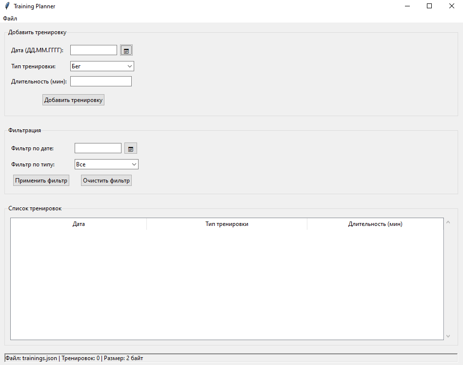
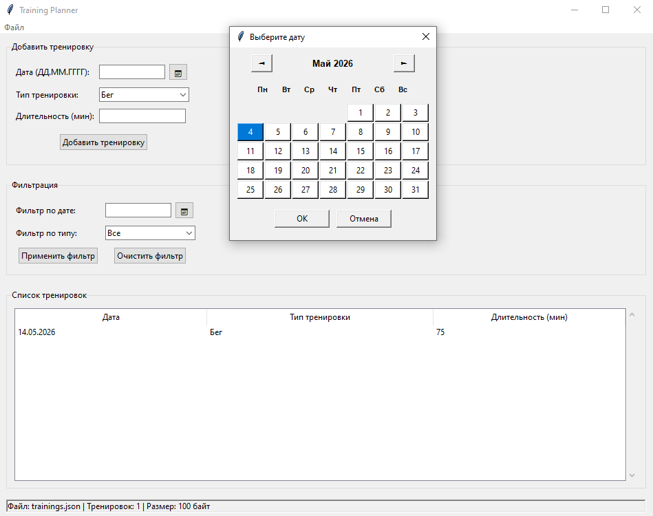
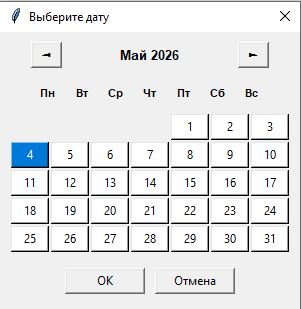
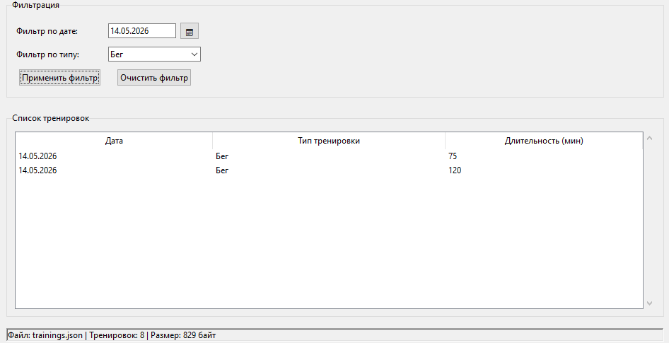
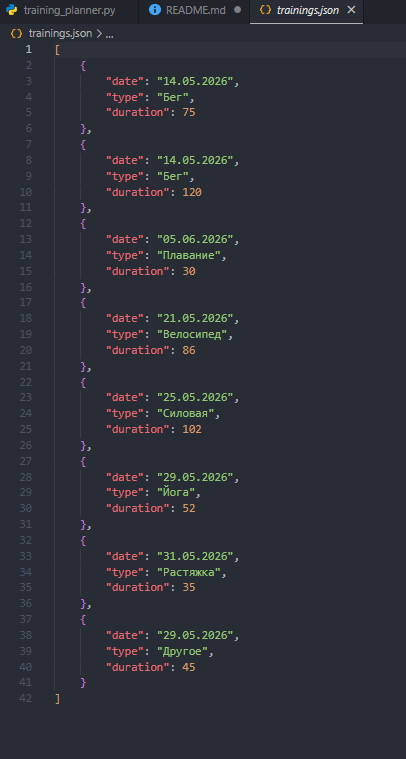
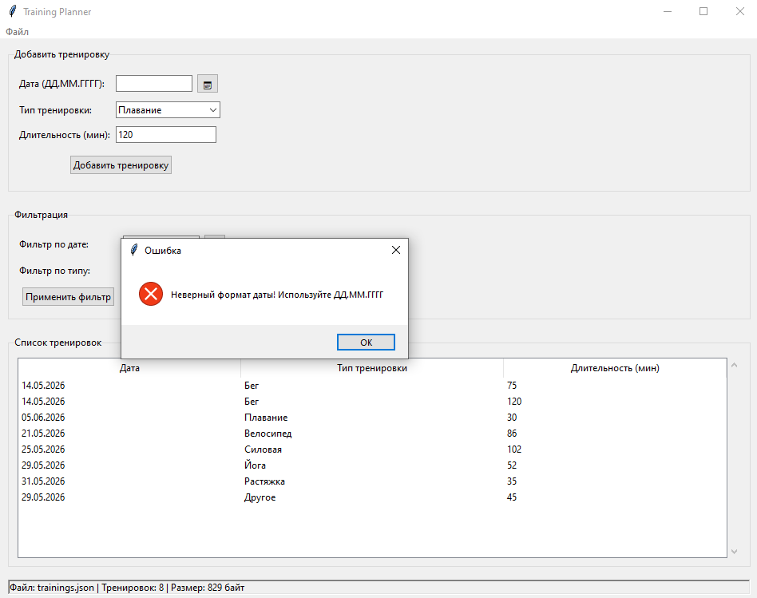

# 🏃 Training Planner

**Автор:** Саидова Мариям Магомедалиевна

**Версия:** 1.0

## 📋 Описание

Training Planner — это десктопное GUI-приложение для планирования, отслеживания и анализа тренировок. Приложение позволяет вести дневник тренировок с удобным интерфейсом, фильтрацией и сохранением данных в формате JSON.

### Основные возможности:
- ✅ Добавление тренировок с указанием даты, типа и длительности
- ✅ Встроенный календарь для выбора даты
- ✅ Автоматическая маска ввода даты (ДД.ММ.ГГГГ)
- ✅ Фильтрация по типу тренировки и дате
- ✅ Сохранение и загрузка данных в JSON формате
- ✅ Экспорт и импорт данных
- ✅ Валидация вводимых данных с понятными сообщениями
- ✅ Удаление записей через контекстное меню
- ✅ Горячие клавиши для быстрой работы

## 📸 Скриншоты

### Главное окно приложения

*Основной интерфейс с таблицей тренировок, формой добавления и фильтрами*

### Добавление тренировки

*Пример заполнения формы: дата через календарь, выбор типа тренировки*

### Календарь для выбора даты

*Встроенный календарь для удобного выбора даты*

### Фильтрация записей

*Применение фильтра по типу тренировки "Бег"*

### Работа с JSON

*Структура сохраняемых данных в JSON формате*

### Сообщения об ошибках

*Пример сообщения при некорректном вводе данных*

## 🚀 Установка и запуск

### Требования
- **Python 3.6** или выше
- **Операционная система:** Windows, macOS, Linux
- **Дополнительные библиотеки:** НЕ ТРЕБУЮТСЯ (используется только стандартная библиотека Python)

### Установка

1. **Клонируйте репозиторий:**
```bash
git clone https://github.com/Marish56/training_planner.git
cd training_planner
